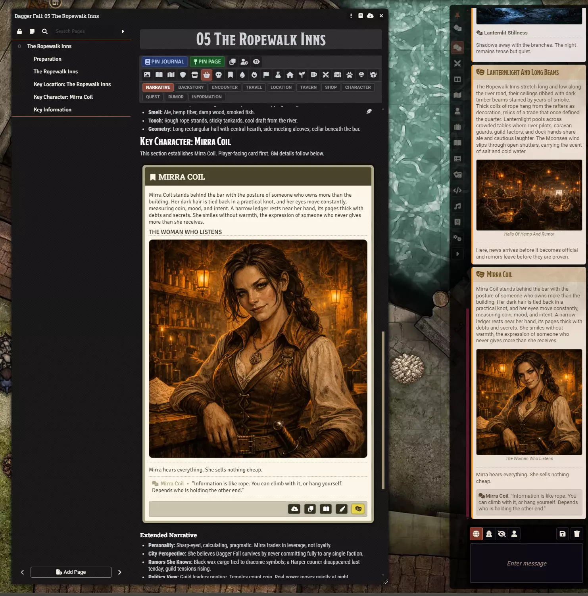

# Coffee Pub Scribe


Write a scene in a journal entry, and put it in front of your players with one click -- as a
formatted card in the chat log, as a handout they can open later, or as a printable HTML file.



## What it does

- **Turns a journal blockquote into a chat card.** Write the passage where you already keep your
  notes; a GM-only toolbar appears on the block, and Narration posts it to the table.
- **Formats a scene.** A heading becomes the card's title, an image gets a caption, and a Heading 6
  becomes a line of dialogue with the speaker's name picked out.
- **Creates handouts.** One click copies the passage into a journal entry the players can open, filed
  in a folder of your choosing, with a link posted to chat.
- **Shares illustrations.** Post a single image from a passage to chat; anyone can click through to
  see it full size.
- **Exports and prints.** Save a page as HTML, or open a whole journal in a browser tab to print or
  save as a PDF, with links to other documents resolved and included.

## Requirements

- **Foundry VTT v13.** Verified against v13; v12 is not supported.
- **[Coffee Pub Blacksmith](https://github.com/Drowbe/coffee-pub-blacksmith)** -- required. Scribe
  will not work without it, and it supplies the chat card styling.

## Install

In Foundry's Add-on Modules tab, choose Install Module and paste this manifest URL:

```
https://github.com/Drowbe/coffee-pub-scribe/releases/latest/download/module.json
```

Then enable both Scribe and Blacksmith in your world's module settings.

## Read more

Full documentation lives in the [wiki](https://github.com/Drowbe/coffee-pub-scribe/wiki):

- [Getting started](https://github.com/Drowbe/coffee-pub-scribe/wiki/userguide-getting-started)
- [The journal toolbar](https://github.com/Drowbe/coffee-pub-scribe/wiki/userguide-journal-toolbar)
- [Writing a scene](https://github.com/Drowbe/coffee-pub-scribe/wiki/userguide-writing-a-scene)
- [Sharing to chat](https://github.com/Drowbe/coffee-pub-scribe/wiki/userguide-sharing-to-chat)
- [Handouts](https://github.com/Drowbe/coffee-pub-scribe/wiki/userguide-handouts)
- [Exporting and printing](https://github.com/Drowbe/coffee-pub-scribe/wiki/userguide-export)
- [Settings](https://github.com/Drowbe/coffee-pub-scribe/wiki/userguide-settings)
- [Known issues](https://github.com/Drowbe/coffee-pub-scribe/wiki/known-issues)

## The Coffee Pub suite

- [Blacksmith](https://github.com/Drowbe/coffee-pub-blacksmith) -- quality of life, gameplay
  frameworks, automation, and aesthetic improvements.
- [Bibliosoph](https://github.com/Drowbe/coffee-pub-bibliosoph) -- in-game player messaging with
  journal-backed conversations, plus authored injuries, quick encounter building, inspiration, and
  critical hit announcements.
- [Crier](https://github.com/Drowbe/coffee-pub-crier) -- enhances combat turn announcements with rich
  visual and audio features, including customizable turn cards, round announcements, and combat
  status tracking.
- [Monarch](https://github.com/Drowbe/coffee-pub-monarch) -- adds the ability to save and load sets
  of enabled modules in Foundry VTT.
- [Squire](https://github.com/Drowbe/coffee-pub-squire) -- a sleek, customizable character tray:
  quick access to your character's abilities, items, spells and conditions, with party tools and item
  transfers.

<!-- global:ai-assistance -->
## AI Assistance and the Illusion of Good Code

I started writing Foundry modules for use at my own table back in 2020. There were already a ton of amazing modules out there, but they either didn't quite do what I wanted or didn't deliver the kind of user experience I was looking for.

I've been a design leader for more than 20 years, but I spent the first half of my career as a developer, so building my own modules seemed like a fun way to kill some time. I'm a pretty good designer. I'm a decent developer. But, over time, my hand-written code and hacks got a little messy (and memory-leaky, and a little buggy. Feels good to say it out loud.).

Today, the Coffee Pub suite of modules is developed with AI assistance, primarily Claude and Cursor, for documentation, refactoring, debugging, and other development work. Every change is reviewed and committed by me, and nothing reaches a release that I haven't crawled and run at my own table. I can't seem to give up my IDE. The UX design, architecture, and ideas still come from my own fever dreams and chronic lack of sleep.

Testing and verifying a change means running it in Foundry so I can watch the console, break things, fix them, and hone the experience. The repositories carry a set of tools for testing the things that are difficult to catch through review and manual testing alone. They help ensure styles don't conflict, shared coding and documentation standards stay consistent, and the suite of modules continues to work well as a system without silently breaking.

Those checks are there because AI-assisted development can move very quickly, and without oversight, engagement, and planning, it can also go confidently off the rails and deliver the illusion of good code. The AI helps me build faster. It doesn't decide what gets built, its architecture, or how it should work. You can blame this human for that.

If the idea of AI-assisted development keeps you up at night or just isn't your jam, no worries at all. I get it. You do you.
<!-- /global:ai-assistance -->

## Licence and credits

MIT. See [LICENSE](LICENSE).

Built by Coffee Pub. Issues and feature requests are welcome on the
[issue tracker](https://github.com/Drowbe/coffee-pub-scribe/issues).
