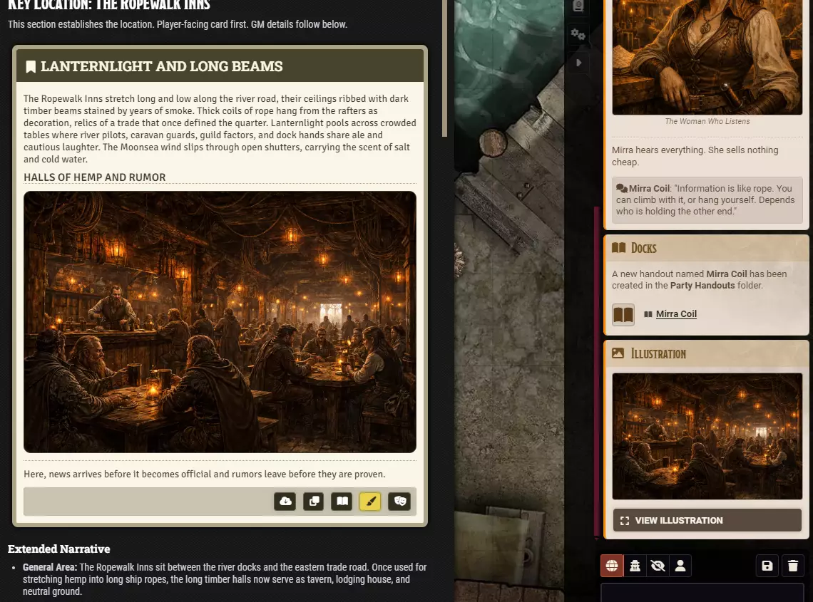

# Handouts

**Audience:** A GM running a game with Coffee Pub Scribe.

Giving players a passage they can open and re-read whenever they want, rather than one that scrolls
away in the chat log.

## Make a handout

Click **Handout** on the blockquote's toolbar. Three things happen at once:

1. A new journal entry is created containing the passage, filed in a folder of your choosing.
2. A card is posted to chat announcing it, with a link to the new entry.
3. A notification confirms where it was filed.

The players click the link in chat and the handout opens. Unlike a narration card, it stays available
for the rest of the campaign.

## Where handouts are filed

The **Folder** setting names the folder, and it is Party Handouts unless you change it. Scribe
creates the folder the first time it needs one, so there is nothing to set up in advance.

**Folder Color** sets its colour in the journal sidebar, as a hex value such as `#77274e`. Worth
setting if you want handouts to stand out from your prep.

Change the folder name later and new handouts go to the new folder. Ones already created stay where
they are.

## What the announcement card says

The card carries the name of the journal the passage came from as its title, a line naming the new
handout and the folder it went to, and a link to the entry itself. The full journal name is shown
however long it is.

The middle card below is a handout announcement, filed in the Party Handouts folder.

## Permissions, and the thing to check

**Creating a handout does not grant anyone permission to read it.** The entry is created and the link
is posted, but a player who does not have permission on that journal entry will click the link and be
unable to open it.

Set the permission on the new entry the way you would for any journal, or set it once on the handouts
folder so everything filed there inherits it.

## Narration, handout, or both

Use **Narration** for something read once, in the moment -- a description as the party enters a room.
Use **Handout** for something they will want again: a letter, a map's legend, a contract, a list of
names. Nothing stops you doing both from the same passage.
